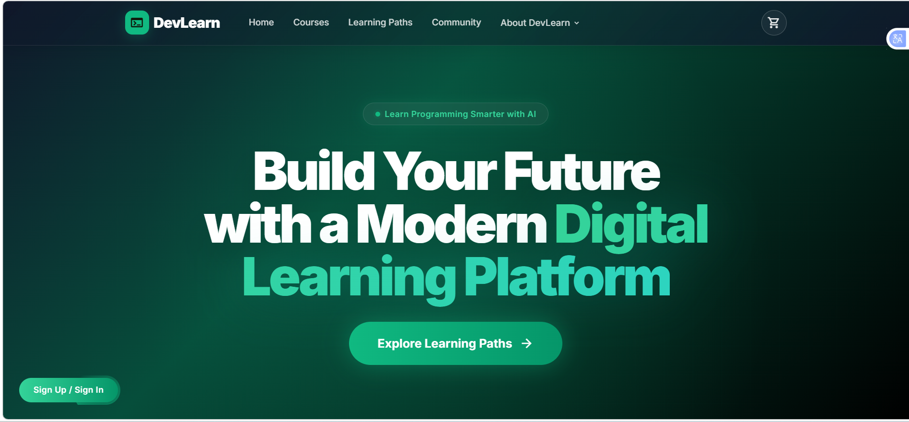
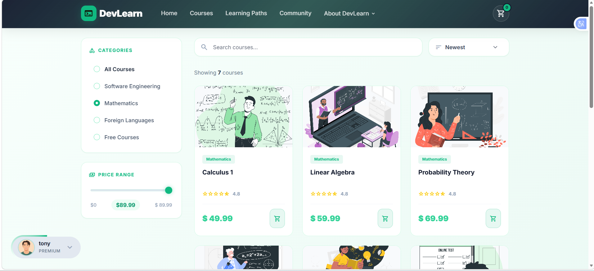
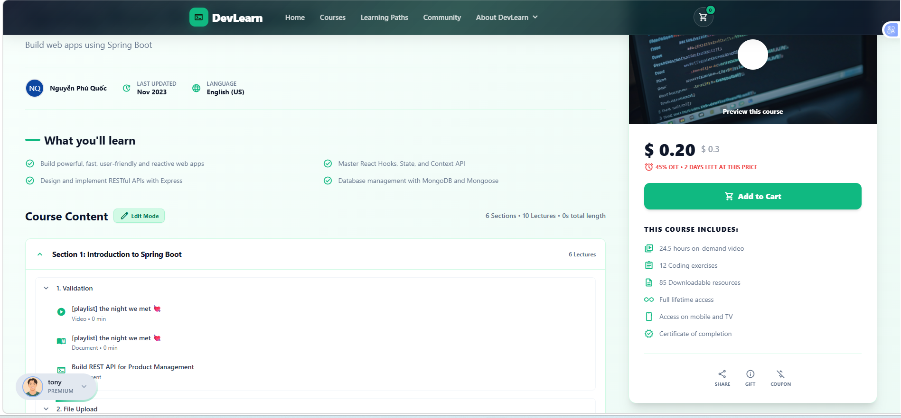
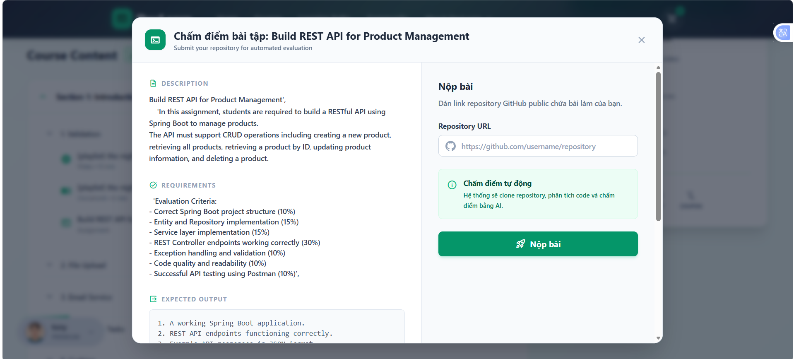
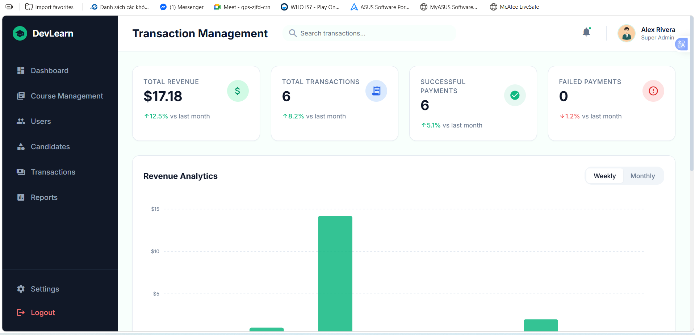
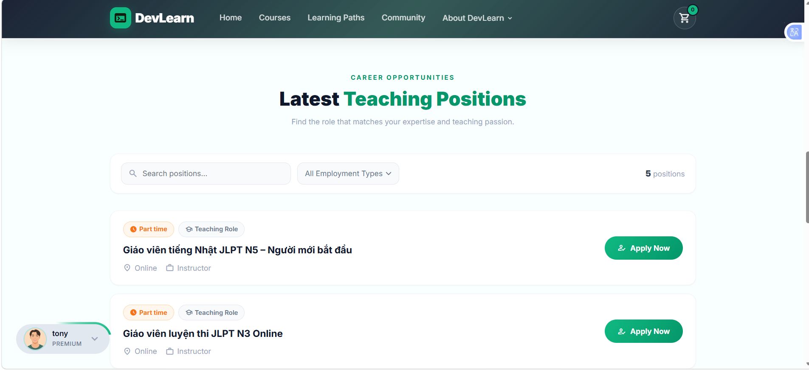

# Project Title
**CourseIT** - Next-Generation Learning Management System

## Project Overview
CourseIT is a comprehensive e-learning platform and Learning Management System (LMS) built with Java Enterprise Edition. It connects students and teachers seamlessly, providing a robust ecosystem for creating courses, tracking learning progress, managing assignments, taking quizzes, and handling subscriptions. The platform distinguishes itself by integrating modern workflows, such as AI-powered code analysis using n8n for assignment grading, Google OAuth for authentication, and PayOS for streamlined course purchases. It also features a built-in recruitment portal allowing administrators to manage teacher hiring through automated CV processing.

## Features
- **User Management & Authentication:** 
  - Role-based Access Control (Admin, Teacher, Student).
  - Secure login with password hashing (BCrypt) and Google OAuth integration.
- **Course & Curriculum Management:** 
  - Teachers can create courses, structured by sections, lessons, and downloadable resources.
  - Interactive quizzes and assignments, complete with criteria-based grading.
- **AI-Powered Grading & Analysis:** 
  - Integration with n8n and GitHub to clone student repositories, analyze code files, and evaluate assignments dynamically using AI.
- **Monetization & Payments:** 
  - Comprehensive Shopping Cart and checkout system.
  - Integration with the PayOS API for handling course payments and tracking transactions securely.
  - Extensible Subscription Plans for sustained revenue models.
- **Recruitment Module:** 
  - Job portal for prospective teachers. 
  - Automated webhook pipeline via n8n for analyzing uploaded CVs, extracting candidate skills, and managing recruitment flow.
- **Cloud Media Storage:** 
  - Integration with Cloudinary for fast and secure hosting of course images, profile pictures, and resources.
- **System Communications:** 
  - Over-the-air notification system and automated OTP/Email functionality using Jakarta Mail.

## Technologies Used
**Backend Core**
- **Language:** Java 21
- **Framework:** Jakarta EE 10 API (Servlets, JSP, JSTL)
- **ORM & Database:** Hibernate Core (7.1.2.Final), Jakarta Persistence (JPA), Microsoft SQL Server (MSSQL JDBC)
- **Database Connection Pooling:** HikariCP
- **Caching:** Caffeine

**Frontend**
- **Templating:** JSP (JavaServer Pages) & JSTL
- **Styling/Scripting:** HTML5, CSS3, JavaScript (Vanilla JS/Custom CSS), integrations with UI libraries.

**Third-Party Services & Integrations**
- **Media Hosting:** Cloudinary
- **Payments:** PayOS
- **AI/Automation pipelines:** n8n (Webhooks)
- **Authentication:** Google OAuth
- **JSON Processing:** Gson
- **Security:** JBCrypt

## Architecture Overview
The application follows a traditional multi-tier Model-View-Controller (MVC) architecture, tailored for Enterprise Java:
- **Presentation Layer (Frontend):** Requests are generated from the JSP views located in `webapp/views`. HTML forms or AJAX calls transmit data to the backend. Static assets are served directly from the `assets` folder.
- **Controller Layer (API & Routing):** Jakarta Servlets (under the `controller` package) interpret requests from the frontend or direct API webhooks (e.g., `N8nApiServlet`), delegating actions to the Service layer.
- **Business Logic Layer (Services & Utils):** The `service` package processes core rules (e.g., course enrollment, progress tracking, payments management). Classes in the `utils` package handle external tasks like Git repository cloning, OTP generation, and Email routing.
- **Data Access Layer (DAO & Repository):** The `dao` and `repository` models leverage Hibernate/JPA to interact with the database, fully abstracting SQL logic.
- **Data persistence (Database):** Hosted on MS SQL Server tracking robust entities spanning across User, Courses, Cart/Payments, and AI Predictions.

## Project Structure
```text
Final_Project_Course/
├── pom.xml                                   # Maven dependency management config
├── src/main/java/courseitproject/
│   ├── config/                               # 3rd-party configs (Cloudinary, Google, Email)
│   ├── controller/                           # Servlet endpoints categorized by role (admin, student, auth...)
│   ├── dao/ & repository/                    # Database abstractions & entity managers
│   ├── dto/                                  # Data Transfer Objects for API payloads
│   ├── filter/                               # Security and Request filtration logic
│   ├── model/                                # JPA Entities mapping SQL Server schema
│   ├── service/                              # Core business logic implementations
│   └── utils/                                # Helpers (GitCloneUtil, PayOSUtil, EmailUtil...)
├── src/main/resources/
│   └── META-INF/
│       └── persistence.xml                   # Hibernate configuration and db credentials
└── src/main/webapp/
    ├── assets/                               # Compiled CSS, JS, and image assets
    └── views/                                # Modularized JSP UI files mapped to servlets
```

## Installation Guide
1. **Clone the repository:**
   ```bash
   git clone <repository_url>
   cd Final_Project_Course
   ```
2. **Setup the Database:**
   - Execute the SQL schema script provided (`sql1.sql`) against your local MS SQL Server instance to create the `Course_Final_Project` database.
3. **Configure the Project Persistence:**
   - Navigate to `src/main/resources/META-INF/persistence.xml`
   - Update `jakarta.persistence.jdbc.url`, `jakarta.persistence.jdbc.user`, and `jakarta.persistence.jdbc.password` to match your local MS SQL Server credentials.
4. **Compile and build:**
   Using Maven, clean and package the project into a WAR file.
   ```bash
   mvn clean install
   ```
5. **Deploy to Application Server:**
   - Deploy the generated `courseProject-1.0.war` found in the target directory to your Jakarta EE 10 compatible web server (e.g., Apache Tomcat 10+, Glassfish, or Payara).
6. **Access the application:**
   - Start the server and navigate to `http://localhost:8080/courseProject` in your browser.

## Environment Setup
To successfully run this project locally, ensure you have the following installed and configured:
- **Java Development Kit (JDK):** Version 21
- **Apache Maven:** Version 3.8+
- **Database Server:** Local Microsoft SQL Server (Ensure TCP/IP is enabled on port 1433)
- **Application Server:** Tomcat 10.1.x or any Jakarta EE 10 Web Profile compliant server
- **Environment Variables/Keys needed in source code (`config` and `utils` package):**
  - Google Client ID and Secret (OAuth)
  - Cloudinary API Keys (CloudinaryConfig)
  - SMTP details for Jakarta Mail (EmailInformationConfig)
  - PayOS API Client/Secret for transactions

## API Endpoints
The backend exposes multiple application layers through conventional Servlets, but primarily leverages dedicated webhooks for server-to-server operations:

- **POST /api/candidates**: Webhook hit by an n8n workflow. It accepts payload relating to processed Teacher CVs (name, cv text url, AI-extracted skill counts, decision metrics) and commits candidate scores contextually into the MSSQL database.
- **REST Integrations**: Handled under conventional root `/resources/*` bounded via JakartaRestConfiguration. Form Submissions and standard navigations utilize mapped servlets (e.g., `/admin/users`, `/student/enroll`).

# CourseIT LMS



## Screenshots

### Course List


### Course Detail


### AI Assignment Grading


### Admin Dashboard


### Teacher apply


## Future Improvements
- Migration of tightly coupled JSP templates to a standalone Frontend web-framework (e.g., Next.js or React) connecting via built out RESTful APIs.
- Transition from Jakarta EE Servlets into a Spring Boot ecosystem for out-of-the-box Microservices capabilities and easier dependency injection.
- Expansion of LMS Dashboard Analytics tailored for both Admin usage and Teacher course performance summaries.
- Redis-backed distributed caching architecture globally, shifting purely away from local Caffeine Cache.

## Author
*Developed and maintained by the CourseIT Team.*
For queries, recruitment pipelines, or to report an issue, please interact with the relevant repository threads.
